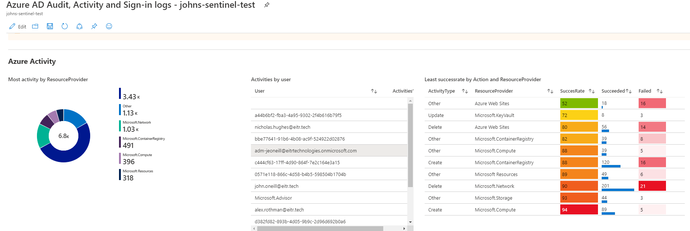
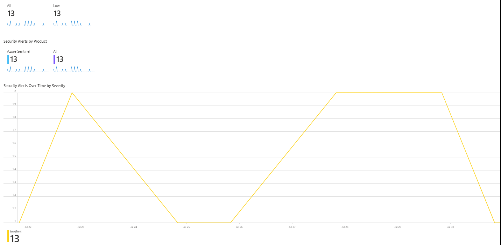
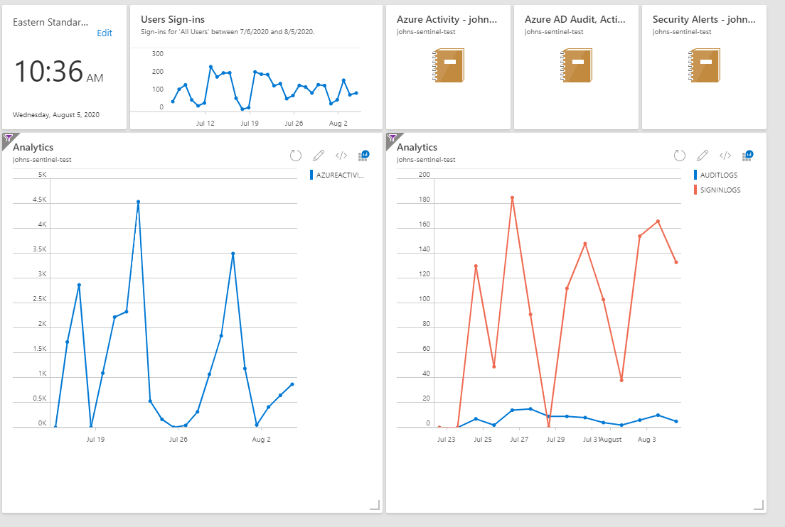
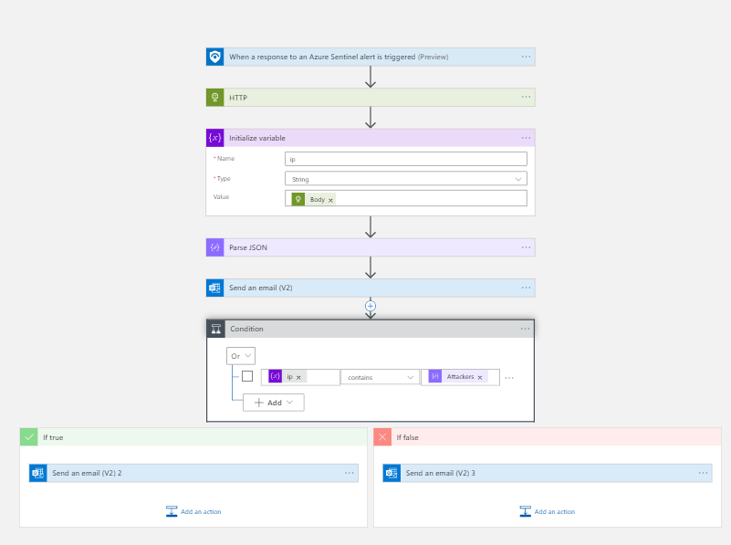

# Azure Sentinel and Why it is Important to You 
In the world of technology, cybersecurity is the #1 priority for any company. And with the almost infinite amount of threats companies can face, protection for your company seems almost impossible to do. In addition to that, many companies only sell partial cybersecurity solutions, but it gets cumbersome to make sure which version of the software is compatible with other types of programs. Companies would be at ease if solutions were in one service. Microsoft heard that call and answered definitively with Azure Sentinel.

Azure Sentinel is both a SIEM (Security Information and Event Management) and a SOAR (Security Orchestration, Automation, and Response) solution that Microsoft created in 2019. Azure Sentinel delivers security and provides a single solution for alert detection, threat visibility, proactive hunting, and threat response.

Now there seem to be a billion cybersecurity solutions and you may ask "what makes Azure Sentinel so special?" Azure Sentinel provides an all in one solution to any piece of software. Even though Azure Sentinel is a Microsoft product where you can connect all of your Microsoft products to make all of them secure; you can also connect non-Microsoft products with Azure Sentinel. This solution provides all one security package for any company. Having all the information in one centralized location is good, but Azure Sentinel takes another step in making it more useful for any company. Azure Sentinel can visualize the data to make it more comprehensible to a user and can automate a certain task to the user’s certain requirements.

Another advantage Azure Sentinel has is that there is a [Github repository] (https://github.com/Azure/Azure-Sentinel) where you can see created custom workbooks, hunting queries, notebooks, and playbooks for Azure Sentinel.

In this article, I will describe the process any company can do with Azure Sentinel. Topics will include how Data connectors and Workbooks work in Azure Sentinel and why people should use them. Another topic will be about the automation side of Azure Sentinel and my experiences with it. The final topic is about how Azure Sentinel works together with Threat Intelligence.

## Data Connectors and Workbooks

Data Connectors give companies the ability to connect their resources in one centralized location. For anyone to work with Azure Sentinel they need to connect their resource via the Data Connector.

Workbooks give users the ability to visualize potential security threats for any resource. For example, with the Azure Directory Data Connector and workbook, I was able to Visualize the Audit and signed in logs as you can see from the picture below.

This is a unique tool because you can take all these graphs and put them into a dashboard so users can see it by default when they log into the Azure portal. This can help with detecting certain errors based on the resource you connected with Azure Sentinel. 

Another Work I implemented was the Security Alerts workbook provided by Microsoft. This workbook provides a visual representation of all the security alerts in Azure Sentinel. The picture below provides an example of what the workbooks would look like.

Another advantage of workbooks is that you can create a custom dashboard with all the data on a screen. Here is what a custom dashboard can look like for any company. Once a user clicks on the workbook icon, the user will see the same data as presented before.

## Automation

After the user gets the data, users would want to see from the resources we can make rules to automate certain tasks to look for anomalies across all resources. For example, Azure Sentinel by default has a rule that will create an incident generated from Azure Security Center. Under Analytics you can create your own rule or use pre-made rules that are not implemented. For example, there is a pre-made rule that can identify a brute force attack by highlighting multiple failures and 1 successful authentication within a given time window. These rules can help to monitor potential threats for any company.

Another version of automation Azure Sentinel provides is logic apps. Logic Apps is a service that assists companies to schedule, automate, and orchestrate certain task. The logic app I created was to post a message in Slack whenever an alert is detected in Azure Security Center you can see the workflow logic in the following picture.

When I finished up the logic app and saved it to Azure Sentinel, I was thinking that it would take a couple of days to get a response. An hour later I received a slack notification saying there was a failed ssh brute force attack. I thought it was one of my bosses testing to see if the logic app was working not. Then the next day I and my bosses were in a meeting and I thanked my boss for checking my logic app to see if it worked, he replied with "I didn't check your app". So, I was shocked to find out that it was a real person trying to do a brute force attack. I was fortunate that it wasn't a serious alert, but this is a good example of why logic apps essential for any company. Logic Apps can help a company detect all types of alerts for companies and they can provide remediation steps on how to prevent alerts.

Another Logic App I created was to detect IP addresses and alert if the IP address was malicious or not. I did this by using the [CINS army list](http://cinsscore.com/list/ci-badguys.txt) and ingesting the IP addresses as a string and every time Azure Sentinel indicates an alert it will detect if the IP address is malicious or not and it will notify accordingly. Here is the workflow logic for the app.

## Threat Intelligence

Threat Intelligence has become a hot topic in the security community as of late. Threat Intelligence is available knowledge that can mitigate or prevent cyberattacks. Threat Intelligence assists companies in understanding what attackers are doing to their systems and how their companies should respond to those attacks. This additional component of Azure Sentinel enhances any company's ability to detect and prioritize known threats. Azure Sentinel does this by having dedicated Analytics, Workbooks, Hunting Queries, Notebooks, and Data Connectors for Threat Intelligence.

Unfortunately, Azure Sentinel fails to include automatic threat intelligence-built ins. However, it does provide some options for companies to acquire threat intelligence. Azure Sentinel gives companies the ability to import threat indicators that they use.

There are multiple ways of streaming threat indicators to Azure Sentinel. You can use one of the Threat Intelligence Platform products that are integrated with Azure; you can connect a TAXII server to Azure Sentinel via a Data Connector, or you can use direct integration with the Microsoft Graph Security Indicators API.

Threat Intelligence can be an essential part of any companies effort towards being secure. Threat Intelligence is not about just ingesting data and putting it on a screen; threat intelligence is about absorbing data and preventing possible cyber-attacks before they happen.

## Conclusion
In conclusion, Azure Sentinel can play an instrumental role in ensuring companies security.  It will take some time to learn and understand, but in the long term, Azure Sentinel can be a useful security tool for any company.

What I did this summer was instrumental in my development to become a computer science professional. Before this internship, I only studied basic concepts in cloud computing. But now I have hands-on experience working with cloud computing which will help me in my professional career as cloud computing becomes more of a common practice for every company. Another thing I learn is not being afraid to fail. Asking questions and trying is essential to be a good worker in any profession.

This summer, I had learned about Microsoft Azure and it has made a better computer scientist. The challenges of working with a cloud platform help made me improve with my problem solving and decision-making skills. I am happy to know that I will bring these skills I learned from EITR Technologies.  
