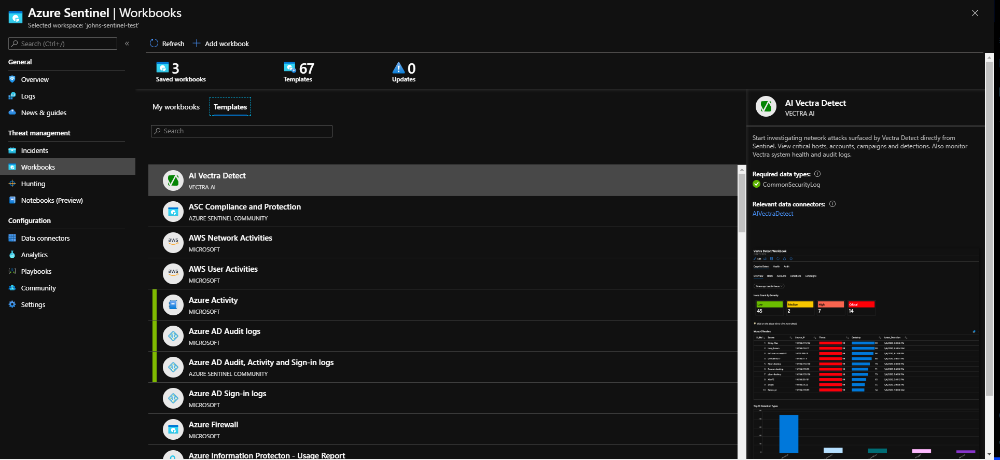
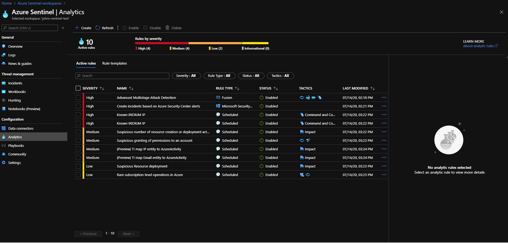
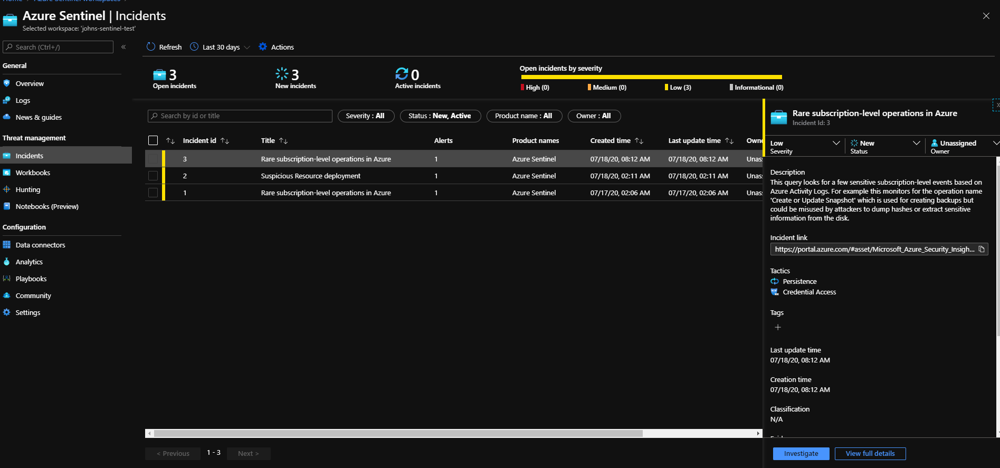
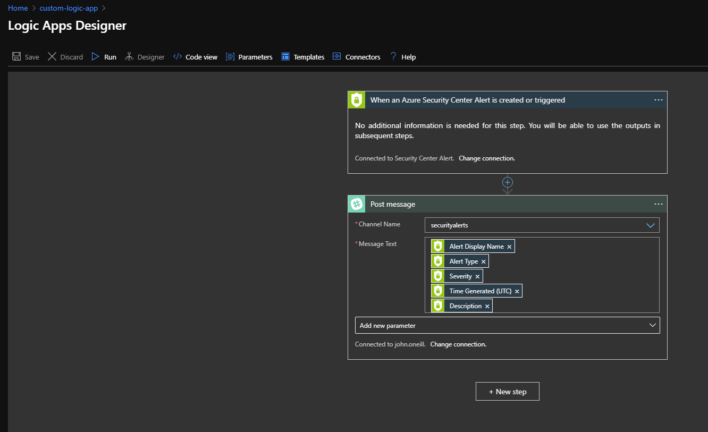
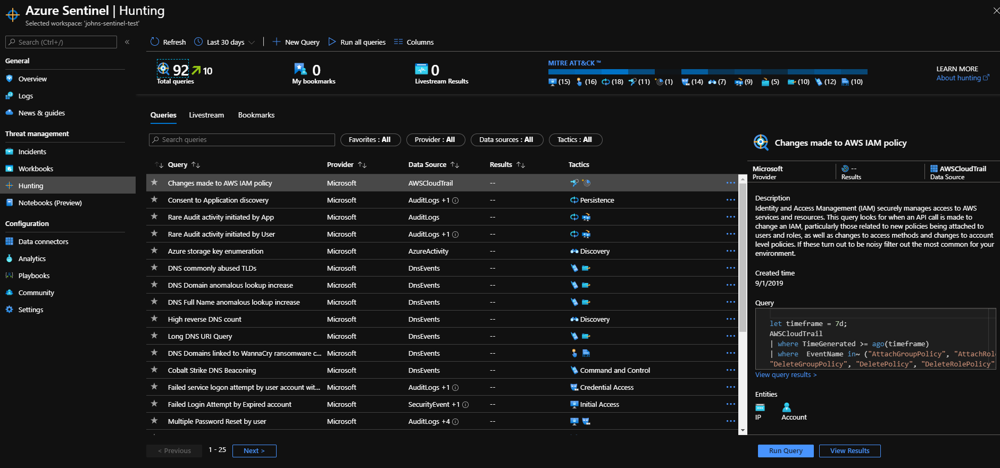

# Azure Sentinel 
In the world of technology, cyber-security is the #1 priority for any company. And with the almost infinite amount of threats any company can face it seems almost impossible to do. In addition to that they are many companies that are selling partial solutions  but it gets cumbersome to make sure which version of what works with each other. It woulds be easier if all of the solutions were in one service. Microsoft heard that call and answered that call with  Azure Sentinel.    

Azure Sentinel is a SIEM (Security Event Information Management) and a SOAR Security Orchestrated Response) that Microsoft has created. Azure Sentinel  delivers security and threat intelligence and proving a single solution for alert detection, threat visibility, proactive hunting and threat response

## Data Connectors 
With Azure Sentinel you can connect all your data sources with data connectors. Sentinel comes with multiple built in connections for Microsoft solutions. For example, you can connect Office 365 for real time integration

## Workbooks 
Once you connect you resources to Azure Sentinel you can monitor the data. You can use the built in Workbooks that Azure provides or you can make custom workbooks. You can build dashboards from the workbooks to visualize the data within the Azure Portal. 

## Analytics
Analytics are rules that can help minimize that amount of threats that have to be reviewed and investigated. You can use Analytics to create Incidents. Analytics ranks severity from high to medium to low to informational. Azure Sentinel will automatically rank the rules them from most sever to the least severe. Below is an example of what Analytics can look in aby companies workspace

## Incidents 
Incidents are a group of related alerts that are created to investigate an solve any actionable threat.Like Analytics, incidents are also ranked by severity 

## Automation
Now, there is a lot of tasks that has to be done to make sure azure portal is secure. Realistically these task takes up a significant amount of time and it would be useful if people didn't have to do the work and instead do more important work. Luckily, Azure Sentinel has tools that can automate tasks for us. 
### Logic Apps
Azure Logic Apps is a service that helps you schedule, automate, and orchestrate certain task. For example, you can automate and security alerts from azure security center  and make it a post it in a slack channel. 
Bellow is an example on how it work if you were to build it with the built in functions Azure has by default. 

Also there is a GitHub repository that has custom logic apps that any one can deploy here is the [link ](https://github.com/Azure/logicapps)
## Hunting 
Hunting is a term in Sentinel were using the search and query tools to proactively hunt for security threats across all data sources, before an alert is triggered. After the threat is deactivated you can make custom detection rules based on the query. Here is list of built-in queries Azure provides. 

## Threat Intelligence 
Threat Intelligence has become a hot topic in the security community as of late. Threat Intelligence is available knowledge that can mitigate or prevent cyberattacks. Threat Intelligence can help companies understand what attackers are doing to their systems and how companies should to respond to those attacks. This can enhance any companies' ability to detect and prioritize known threats. Azure Sentinel does this by having dedicated Analytics, workbooks, hunting query, notebooks and data connectors for Threat Intelligence.  

Unfortunately, Azure doesn't have any automattic threat intelligence built in however, Azure Sentinel provides some options for companies to acquire threat intelligence. Azure Sentinel gives companies the ability to import threat indicators that they use. 

There are multiple ways of streaming threat indicators to Azure Sentinel. You can use one of the Threat Intelligence Platform products that is integrated with Azure, you can connect a TAXII server to Azure Sentinel via a data connector or you can use direct integration with the  Microsoft Graph Security tiInicators API. 

I wasn't able to implement any of these towards EITR's Azure subscription. Regardless, Threat Intelligence can be an essential part of any companies effort towards being secure. Threat Intelligence is not about just ingesting data and putting it on a screen, it is absorbing data and preventing possible cyber attacks before they happen. 
## Conclusion
In conclusion, Azure Sentinel can play an instrumental role in making your company secure. It will take some time to learn and understand but in the long term, Azure Sentinel can be a useful security tool for any company. 
Another advantage Azure Sentinel has is Azure Sentinel has a Github [repository](https://github.com/Azure/Azure-Sentinel) where you can see created custom workbooks, hunting queries, notebooks, and playbooks for Azure Sentinel.

This summer I had learn about Microsoft Azure and it has made a better computer scientist.  The challenges of working with a cloud platform help made me improve with my problem-solving and decision making skills. I happy to hear to that I will being these skills I learn from EITR technologies in my future endeavors. 
